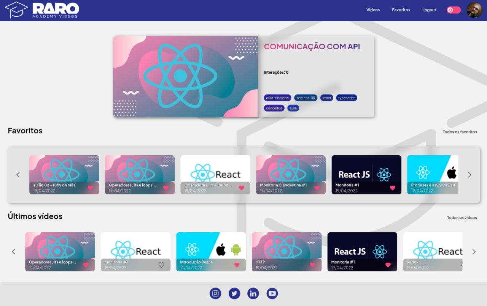
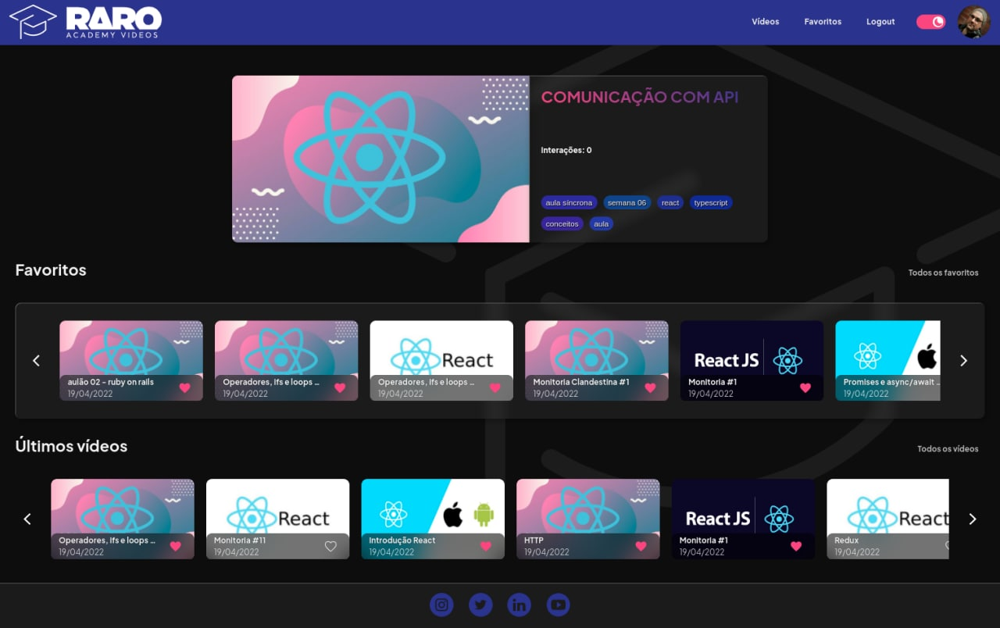

<div align="center">

  
  <h1>Raro Academy Videos</h1>
  <p>
    Plataforma com seus conteúdos Raro Academy
  </p>

<!-- Badges -->
<p>

</p>

<h4>
    <a href="https://raro-academy-videos.vercel.app/">Demo</a>
  <span> · </span>
    <a href="https://github.com/rarolabs/raro-academy-react-grupo-6/issues/new">Reporte Bug</a>
  <span> · </span>
    <a href="https://github.com/rarolabs/raro-academy-react-grupo-6/pulls/">Request Feature</a>
  </h4>
</div>

<br />

<!-- Table of Contents -->

## 📔 **Documentação**

- [📔 **Documentação**](#-documentação)
- [🌟 **Sobre o projeto**](#-sobre-o-projeto)
- [🎯 **Objetivos principais**](#-objetivos-principais)
- [🥳 App](#-app)
- [💡 **Proposta**](#-proposta)
- [🙾 **Design System**](#-design-system)
- [💻 **Tecnologias Principais**](#-tecnologias-principais)
- [💁🏽‍♀️ **Tecnologias de Suporte**](#️-tecnologias-de-suporte)
- [🛠️ **Ferramentas**](#️-ferramentas)
- [😰 **Desafios**](#-desafios)
- [🪁 **Futuras implementações**](#-futuras-implementações)
- [📚 **Referências**](#-referências)
- [🤼‍♂️ **Desenvolvedores**](#️-desenvolvedores)
- [🤖 **Executando o projeto localmente**](#-executando-o-projeto-localmente)
- [👍🏽 **Agradecimentos**](#-agradecimentos)

<!-- About the Project -->

## 🌟 **Sobre o projeto**

Projeto final do curso de React da Raro Academy que visa melhorar o modelo de distribuição do conteúdo dos cursos, criando um portal de acesso aos materiais de vídeo, onde os usuários poderão visualizar o conteúdo disponibilizados na plataforma.

## 🎯 **Objetivos principais**

Desenvolver com React uma plataforma web funcional conforme descrito detalhadamente no [enunciado oficial](./.github/raro_enunciado.md), utilizando API disponibilizada pela Raro Academy para acesso. As regras e critérios de avaliação se encontram [aqui](./.github/raro_regras.md).

- [x] HOME (pública)
  - [x] Conteúdo público
  - [x] Botão de login
- [x] LOGIN
  - [x] Autenticação
  - [x] Link para cadastro novo usuário
  - [x] Esqueci minha senha
- [x] CADASTRO NOVO USUÁRIO
- [x] HOME (com autenticação do usuário)
  - [x] Conteúdo público e relativo a turma do usuário
  - [x] Conteúdo categorizado por playlist
  - [x] Conteúdo favoritado / caso vazio mostrar como favoritar
- [x] VISUALIZAÇÃO DE CONTEÚDO
  - [x] Visualização do vídeo
  - [x] Playlist com vídeos recomendados
  - [x] Área de comentários com botão de _like_ e _dislike_
  - [x] Ação de comentar somente para usuários cadastrados
  - [x] Botão de favoritar

## 🥳 App

<p align="center">
  
  
</p>

## 💡 **Proposta**

Entregar um produto moderno, funcional e intuitivo no qual os alunos possam acessar as aulas gravadas, compartilhar conhecimento e estender a rede de apoio entre os membros da Raro Academy e comunidade.

## 🙾 **Design System**

Utilizamos alguns conceitos e ferramentas para padronizar várias etapas do nosso projeto.

- #### **Design Patterns**

  - Styled guide: padrão e regras [Airbnb](https://github.com/airbnb/javascript/tree/master/react) React.
  - Aplicação das regras e padrões: [ESLint](https://eslint.org)
  - Formatação automática com base nas regras: [Prettier](https://prettier.io/)

- #### **Gitflow**

  - Padrão de _commits_: [Convencional Commits](https://conventionalcommits.org/)
  - Formataçao de commits: [Commitizen](https://commitizen-tools.github.io/commitizen/)

- #### **Visual Design**

  Juntamos o [pacote de identidade visual](https://drive.google.com/drive/folders/1rDGwAET7yZ1oBXrYe5Ru-p0h_tU6w5Ds) disponibilizado e um estudo feito sobre a forma que a empresa se apresenta na internet e formamos nosso _style guide_ seguindo um estilo mais moderno. As telas do projeto na plataforma do [Figma](https://www.figma.com/). 🔗 [Projeto](https://www.figma.com/file/rPQ9yleOpcl9V2SIyUlSQ3/Telas?node-id=3%3A2).

## 💻 **Tecnologias Principais**

[](https://developer.mozilla.org/pt-BR/docs/Web/JavaScript)
[](https://www.typescriptlang.org/)
[](https://https://reactjs.org/)
[](https://developer.mozilla.org/pt-BR/docs/Web/HTML)
[](https://developer.mozilla.org/pt-BR/docs/Web/CSS)
[](https://swagger.io/)

## 💁🏽‍♀️ **Tecnologias de Suporte**

Algumas tecnologias auxiliaram no desenvolvimento do projeto, dentre elas:

- [Material UI](https://material-ui.com/)
  - Padrão de estilo do Material UI foi a base para inicio do projeto. Usamos da sua estrutura de temas e também de alguns componentes.
- [Styled Components](https://www.styled-components.com/)
  - Usamos para aplicar estilos aos componentes de forma invidual e restrita, com mais controle sobre as propriedade _CSS_ de cada elemento.
- [React Hook Form](https://react-hook-form.com/)
  - É uma biblioteca que nos ajuda a criar formulários com bom gerenciamento de estado e juntamente com um esquema criado com [Yup](https://www.npmjs.com/package/yup) fazemos a validação de cada campo antes mesmo da requisão com _API_.
- [React Router Dom](https://reacttraining.com/react-router/)
  - Utilizamos para criar rotas e navegação entre telas. Além de criar rotas protegidas e não protegidas, podemos utilizar dos seus parâmetros dinâmicos.
- [Axios](https://axios-http.com/)
  - Podemos utilizar o Axios para requisições HTTP e também para requisições com _API_. Além de nos ajudar a criar um serviço personalizado de consultas.
- [React Player](https://www.npmjs.com/package/react-player)
  - Usamos na reprodução dos vídeos, pois além de funcional, possuir boa ferramentas de controle, é também não opinativa.

## 🛠️ **Ferramentas**

[](https://code.visualstudio.com/)
[](https://www.figma.com/)
[](https://www.microsoft.com/pt-br/windows/get-windows-10)
[](https://www.microsoft.com/pt-br/windows/get-windows-10)
[](https://www.npmjs.com/)
[](https://git-scm.com/)
[](https://github.com/)

## 😰 **Desafios**

- Paginação da API
- Carousel
- Manipulação do scroll
- Material UI na integração com outros componentes
- Implementação do nosso próprio player de vídeo
- CSS

## 🪁 **Futuras implementações**

- Espaço para download de arquivos
- Ordenação de comentários
- Lista últimos visualizados
- Implementação de cookies
- Possibilidade de inserir emojis nos comentários

## 📚 **Referências**

Nos inspiramos em sites como [Udemy](https://www.udemy.com), [Netflix](https://www.netflix.com), [YouTube](https://www.youtube.com), [Twitch](https://www.twitch.tv/) e no da própria [Raro Academy](https://www.raroacademy.com.br/) para elaboração de como deveríamos exibir o conteúdo dos cursos e a seção de comentários, atendendo a todos os requisitos propostos.

## 🤼‍♂️ **Desenvolvedores**

<p>
<a href="https://github.com/ICarlosMarinho">
  
</a>
<a href="https://github.com/laripeanuts">
  
</a>
<a href="https://github.com/Rogerio0Vieira">
  
</a>
<a href="https://github.com/Thaynnah">
  
</a>

</p>

## 🤖 **Executando o projeto localmente**

- Projeto iniciado usando [Create React App](https://github.com/facebook/create-react-app).

Clone o projeto

```bash
  git clone https://github.com/rarolabs/raro-academy-react-grupo-6.git
```

Vá para a raiz do diretório

```bash
  cd raro-academy-react-grupo-6
```

Instale as dependências

```bash
  npm install
```

Inicie o servidor local

```bash
  npm start
```

Analisar erros padrões com ESLint

```bash
npm run lint

```

Corrigir padrões com ESLint

```bash
npm run lint:fix

```

## 👍🏽 **Agradecimentos**

- [Raro Academy](https://www.raroacademy.com.br/)
- [Júlia Febraro](https://www.linkedin.com/in/j%C3%BAlia-febraro-68a50989/)
- [Paulo Fernandes](https://github.com/pauloFernandes)
- [Breno Peruchi](https://github.com/bperuchi)
- [Rodrigo Sol](https://github.com/rodrigosol)
- [Mateus Mendes](https://github.com/m7he4rt)
- [Tamir Faria](https://github.com/tamirfaria)
- [Ramon Setragni](https://www.linkedin.com/in/ramon-setragni-63842832/)
- E todos os outros professores que nos ajudaram.

<p align="center">Copyright ☕ 2022
